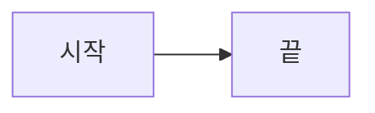
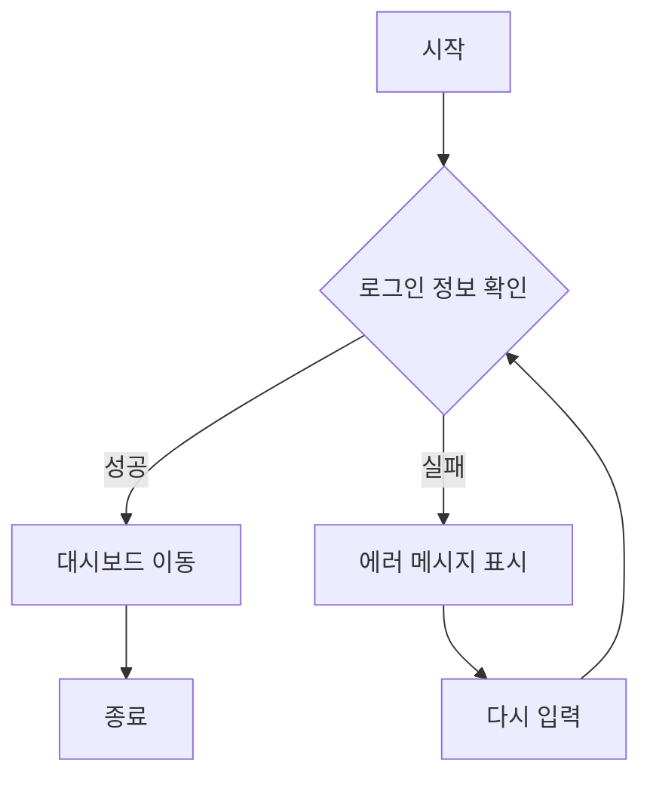
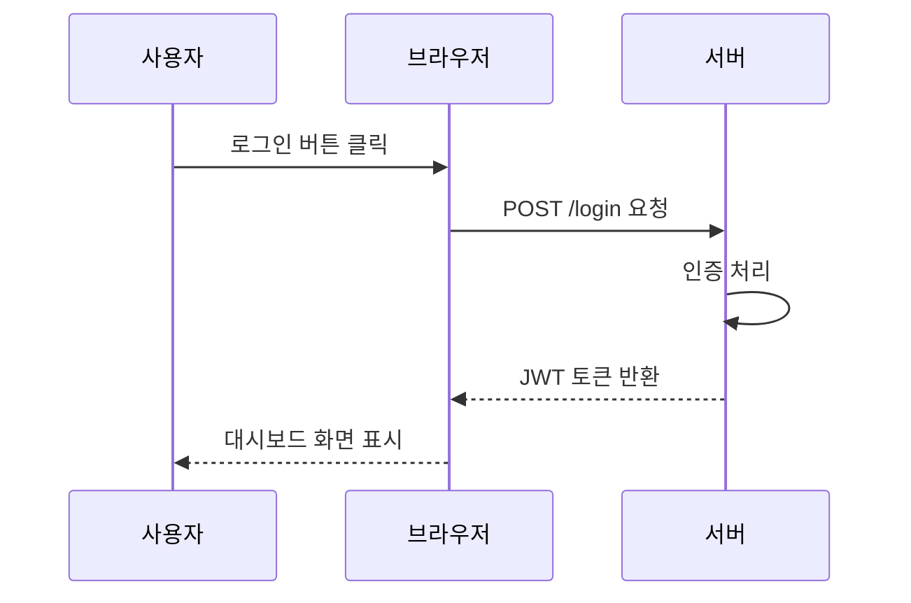
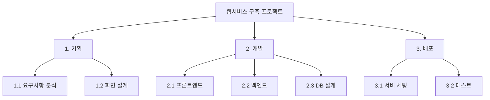
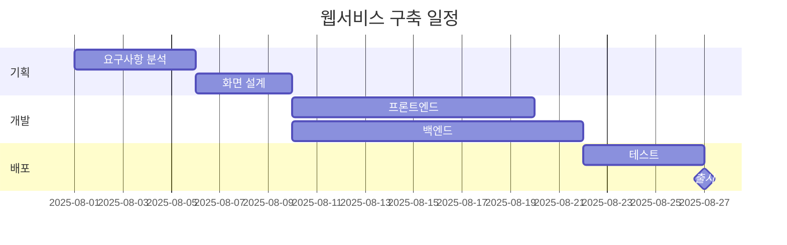
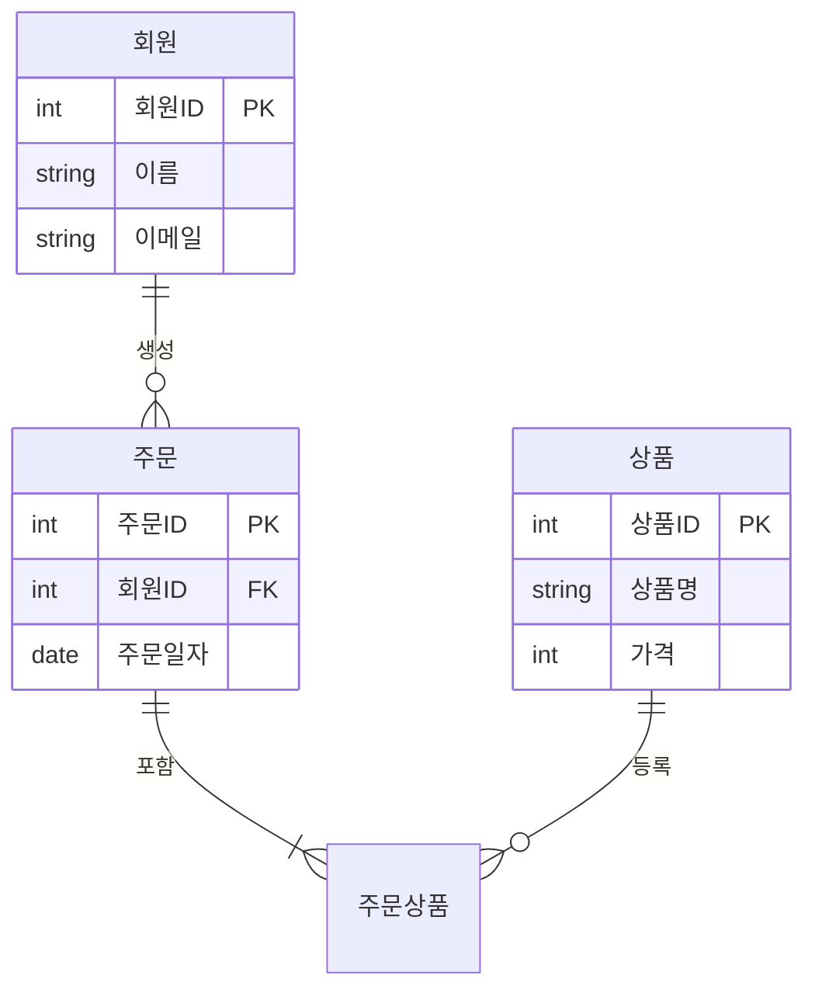

# hello world
* hello
* hello
- hello
- hello

# hell world
1. hello
2. hello

- [ ] hello
- [ ] hello

[위니브](https://www.weniv.co.kr)

| 헤더 1 | 헤더 2 | 헤더 3 |
|--------|--------|--------|
| 값 1   | 값 2   | 값 3   |
| 값 4   | 값 5   | 값 6   |

---

## 1. 플로우차트 (Flowchart)

가장 기본이 되는 순서도다. 조건 분기와 반복 흐름을 표현할 때 쓴다.

---

## 2. 시퀀스 다이어그램 (Sequence Diagram)

객체 간에 시간 순서대로 오가는 메시지를 표현한다. API 통신 설명에 자주 쓴다.

---

## 3. WBS (작업 분해 구조)

머메이드에 WBS 전용 문법은 없어서 `graph TD` 트리로 계층을 표현하는 방식이 가장 WBS답게 나온다. 번호 체계를 넣어주면 실제 WBS 느낌이 살아난다.

참고로 `mindmap` 문법으로도 WBS 비슷하게 그릴 수 있는데, 네모 박스 계층 구조가 필요하면 위처럼 `graph TD`가 더 적합하다.

---

## 4. 간트 차트 (Gantt Chart)

프로젝트 일정을 시간축으로 보여준다. WBS로 나눈 작업을 그대로 일정으로 옮기면 이어서 설명하기 좋다.

---

## 5. ER 다이어그램 (Entity Relationship)

데이터베이스 테이블 간 관계를 표현한다. 카디널리티(`||--o{`) 기호를 설명하면 학생들이 관계형 모델을 이해하는 데 도움이 된다.

